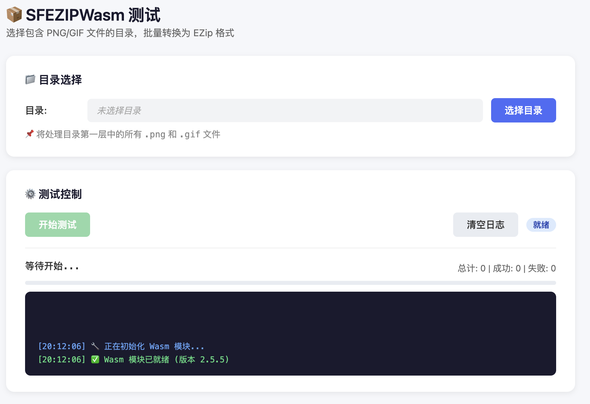

# SFEZIPWasm
SFEZIPWasm 是eZIPSDK的WebAssembly版本。

## 1.初始化
```
 import { SifliEzipUtil, SFBoardType, SFEZIPColorType } from '../wrapper/SifliEzipUtil.js';
 // 加载并注入 Wasm 实例
  const wasmInstance = await EZIPWasm();
  SifliEzipUtil.setModule(wasmInstance);
```
## 2.接口定义
- 芯片板子类型

```javascript
export const SFBoardType = {
    TYPE_55X: 0,
    TYPE_56X: 1,
    TYPE_52X: 2,
    TYPE_57X: 3,
    TYPE_58X: 4,

    isValidBoardType(boardType) {
        return boardType >= 0 && boardType <= this.TYPE_58X;
    }
};
```

- eZIP输出颜色

```javascript

export const SFEZIPColorType = {
    RGB565: 0,
    RGB565A: 1,
    RGB888: 2,
    RGB888A: 3
};
```

- png -> ezip

```javascript
/**
     * transform png data to ezip bin, support gif to apng
     * @param pngData png or gif data
     * @param colorType color type @see SFEZIPColorType
     * @param ezip_color_type
     * 0 keep original alpha channel
     * 1 no alpha channel
     * @param ezip_bin_type
     * set 0 to support rotation
     * set 1 for no rotation
     * @param boardType @see SFBoardType
     * @return ezip or apng result, null for fail
     */
static pngToEzip(pngData, colorType, ezip_color_type, ezip_bin_type, boardType)
```

- 序列帧

```javascript
  /**
     * Convert a set of png images
     * @param pngData png data as arraylist, will be converted in the order of the images in the arraylist
     * @param colorType color type  @see SFEZIPColorType
     * @param ezip_color_type
     * 0 keep original alpha channel
     * 1 no alpha channel
     * @param ezip_bin_type
     * set 0 to support rotation
     * set 1 for no rotation
     * @param boardType @see SFBoardType
     * @param interval 动画间隔 0 默认间隔
     * @return ezip or apng result, null for fail
     */
    static pngToEzipSequence(pngDataArray, colorType, ezip_color_type, ezip_bin_type, boardType, interval)
```

- 设置lvgl版本

```javascript
 /**
     * 设置lvgl version 7/8/9
     * */
    static setLvglVersion(lvglVersion)
```

- gzip

```javascript
 /**
     * gzip 数据压缩
     * @param inData 输入原始数据
     * @return gzip数据，返回null失败。没有header和length,不需要做偏移.
     * */
    static gzipWithData(inData)
```

## 3.测试
将本仓库下载到本地

```bash
cd SFEZIPWasm
在根目录启动HTTP 服务
python3 -m http.server 8080
```
### 3.1 png->ezip测试
`http://localhost:8080/demo/index.html`

### 3.2 gzip 测试
`http://localhost:8080/demo/gzip_test.html`

## 4.效果图


